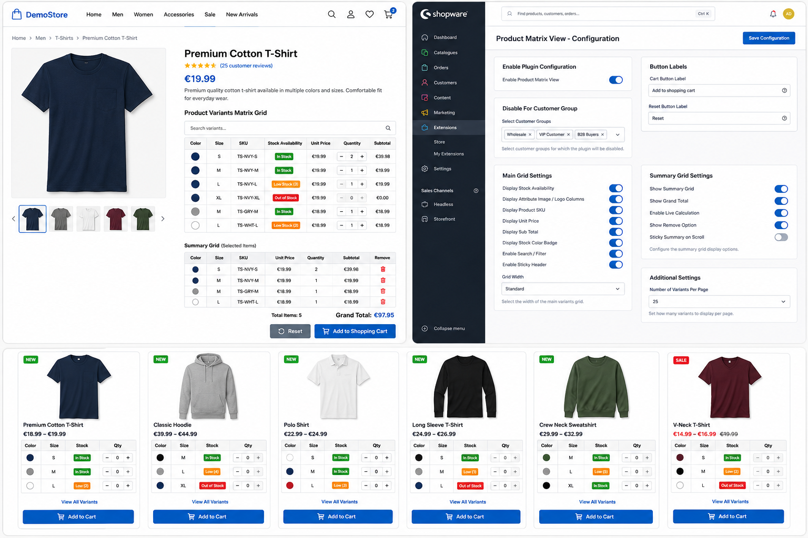

# Product Variants Matrix Extension for Shopware 6

A powerful Shopware 6 plugin that transforms product variant selection with an intuitive **matrix/grid view** for displaying product variants in a tabular format. Perfect for stores selling products with multiple options like clothing, furniture, or any configurable items.

**Status**: ✅ Production Ready | **Version**: 1.0.0 | **License**: Proprietary

---

## 🎯 Features Overview

### Core Functionality
- **Intuitive Matrix Grid Display** - Present all product variants in an organized, easy-to-scan table format
- **Smart Variant Selection** - Select multiple variants at once with individual quantity controls
- **Real-Time Summary** - Live totals showing selected items, quantities, and prices
- **Bulk Add to Cart** - Add multiple variants to the shopping cart in a single action
- **Product Listing Support** - Display compact variant matrix on category and listing pages
- **Search & Filter** - Built-in search functionality to quickly find variants by SKU, attribute, or name

### Customization Options
- **Flexible Column Display** - Toggle visibility of stock, price, SKU, subtotals, and attributes
- **Configurable Grid Width** - Choose from Standard, Half (50/50 with product image), Large, or X-Large layouts
- **Custom Button Labels** - Personalize "Add to Cart" and "Reset" button text
- **Stock Status Badges** - Visual indicators showing product availability (In Stock, Low Stock, Out of Stock)
- **Customer Group Restrictions** - Show/hide matrix grid based on customer groups
- **Dynamic Product Targeting** - Display matrix for specific product streams/dynamic product groups

### Admin Control
- **Easy Configuration Panel** - Shopware admin interface for all settings
- **Per-Store Settings** - Configure globally or per store/sales channel
- **Multi-Language Support** - English (EN-GB) and German (DE-DE) translations included
- **Event-Based Customization** - Subscriber hooks for product page and listing events

---

## 📸 Plugin In Action

### Product Detail Page with Matrix Grid & Admin Configuration



**Features Highlighted in Image:**
- **Matrix Grid Display** - Variant table with Color, Size, SKU, Stock Status, Price, Quantity, and Subtotal columns
- **Visual Indicators** - Color-coded stock badges (Green = In Stock, Orange = Low Stock, Red = Out of Stock)
- **Real-Time Pricing** - Individual and subtotal price calculation
- **Summary Grid** - Selected items with quantity and total price overview
- **Admin Config Panel** - Easy-to-use settings for grid customization (visible on the right side)
- **Search Functionality** - Built-in search bar to filter variants by SKU, color, or size
- **Responsive Design** - Clean, professional layout optimized for Shopware stores

This screenshot demonstrates the plugin's core functionality in a live Shopware storefront (DemoStore) with:
- Multiple product variants displayed in an intuitive matrix format
- Real-time summary of selected items
- Bulk cart addition capability
- Admin configuration interface showing all available settings

**Key Benefits Visible:**
✅ Customers see all variants at a glance  
✅ Faster product selection with quantity controls  
✅ Transparent pricing with real-time calculations  
✅ Professional admin interface for store owners  
✅ Flexible configuration for different business needs

---

## 🚀 Installation & Setup

### Requirements
- Shopware Core: ^6.5.0
- Shopware Administration: ^6.5.0
- Shopware Storefront: ^6.5.0
- PHP: 7.4+ (compatible with Shopware 6.5+)

### Installation Steps

1. **Download the Plugin**
   ```bash
   cd custom/plugins
   git clone https://github.com/Priyanshu6861/Product-Variants-Matrix-Extension.git ProductVariantsMatrix
   ```

2. **Install Dependencies**
   ```bash
   cd ../../
   composer require config-product-matrix-view/config-product-matrix-view
   composer dump-autoload
   ```

3. **Install & Activate in Shopware**
   ```bash
   php bin/console plugin:install --activate ProductVariantsMatrix
   php bin/console cache:clear
   ```

4. **Build Storefront Assets**
   ```bash
   npm run build:js
   # or for development
   npm run watch:js
   ```

5. **Verify Installation**
   - Log in to Shopware Admin
   - Navigate to Settings → Plugins → Installed
   - Find "Product Matrix View" and verify it's activated
   - Go to Settings → System Settings → ProductVariantsMatrix to configure

---

## ⚙️ Configuration Guide

### Basic Setup

1. **Enable the Plugin**
   - Navigate to: **Settings → System Settings → ProductVariantsMatrix**
   - Check "Enable" toggle to activate the matrix grid

2. **Customize Labels**
   - Set custom "Cart Button Label" (e.g., "Add All to Cart")
   - Set custom "Reset Button Label" (e.g., "Clear Selection")

3. **Restrict by Customer Group** (Optional)
   - Select customer groups where the matrix should NOT appear
   - Leave empty to show for all customers

### Grid Appearance

**Main Grid Settings:**
- Display Stock Availability - Show/hide stock quantity column
- Display Attribute Image/Logo Columns - Show product attribute visuals
- Display Product SKU - Include product code/SKU column
- Display Unit Price - Show individual variant prices
- Display Sub Total - Show calculated totals per variant
- Display Stock Color Badge - Color-coded availability indicators
- Display Out of Stock Products - Include unavailable variants
- Display Total Stock Detail - Show overall stock summary
- Display Search Functionality - Enable variant search bar
- Grid Width - Select layout (Standard, Half, Large, X-Large)

**Summary Grid Settings:**
- Display Summary Grid - Show selected items overview
- Display Total Quantity - Show total selected quantity
- Quantity Label - Custom text for quantity (default: "Qty")
- Display Grand Total - Show price total
- Total Label - Custom text for total (default: "Total")

### Product Listing

**Product Listing Card Settings:**
- Enable Matrix View On Product Listing - Toggle listing page display
- Enable Categories For Product Listing Grid - Select which categories show the matrix
- Display Attribute Image/Logo Columns - Show attributes in listing
- Display Product SKU - Include SKU in compact listing view
- Display Unit Price - Show pricing in listing
- Display Sub Total - Show calculated totals
- Display Stock Color Badge - Stock status indicators
- Display Out of Stock Product - Include unavailable variants
- Display Total Stock Detail - Show stock summary

---

## 🎨 How It Works

### Product Detail Page
1. When a customer visits a product detail page, the plugin checks if the matrix grid is enabled
2. If enabled and variants exist, the grid replaces or supplements standard variant selectors
3. Customers can:
   - View all variants in a single table
   - Select colors/sizes/attributes visually
   - Enter quantities for each variant
   - See real-time pricing and availability
   - Add all selected variants to cart at once

### Summary Grid
- Below the main matrix, a summary shows all selected items
- Updates in real-time as quantities change
- Shows grand total for all selections
- "Reset" button clears all selections

### Product Listing
- For enabled categories, a compact matrix appears on product cards
- Shows first 3 variants in a preview
- Click to expand for full variant selection modal

---

## 🛠️ Technical Architecture

### PHP Components
- **ProductVariantsMatrix.php** - Plugin bootstrap class, handles installation/custom field setup
- **VarientProducts.php** - Event subscriber for product page and listing events
- **AddToCartController.php** - AJAX endpoint for bulk variant cart addition

### Frontend Assets
- **varient-products.plugin.js** - Main grid plugin (desktop product detail)
- **varient-minimal-products.js** - Listing page compact grid plugin
- **base.scss** - Styling for all components

### Configuration
- Service definitions and DI container setup
- System configuration schema (config.xml)
- Route definitions for AJAX endpoints

### Events Subscribed
- `ProductPageLoadedEvent` - Injects variant data into product detail page
- `ProductListingResultEvent` - Adds variant data to listing results

---

## 🔧 Advanced Usage

### Custom Field Setup
The plugin automatically creates a custom field (`matrix_enabled`) during installation:
- **Custom Field Name**: matrix_enabled
- **Type**: Boolean (Switch)
- **Use**: Per-product control to enable/disable matrix for specific products
- **Location**: Products → Attributes → "Enable Product Matrix View"

### API Routes
- **Endpoint**: `/cart/addVariants`
- **Method**: POST
- **Route Name**: `frontend.matrix.checkout.addVariants`
- **Payload**: 
  ```json
  {
    "variantsIds": {
      "variant-id-1": {"id": "variant-id-1", "qty": 2},
      "variant-id-2": {"id": "variant-id-2", "qty": 1}
    }
  }
  ```

### Configuration Service
All settings are stored in Shopware's system configuration:
```php
$config = $systemConfigService->get('ProductVariantsMatrix.config');
// Access individual settings:
$enabled = $systemConfigService->get('ProductVariantsMatrix.config.configMatrixEnable');
```

---

## 🌍 Multi-Language Support

The plugin includes translations for:
- **English (EN-GB)** - Full translation
- **German (DE-DE)** - Full translation (Deutsch)

**Snippet Keys**:
- `variant.summary` - Summary grid label
- `variant.reset` - Reset button default text
- `variant.sku` - SKU column header
- `variant.attribute` - Attribute column header
- `variant.qty` - Quantity column header
- `variant.unit-price` - Unit price label
- `variant.sub-total` - Subtotal label
- And more...

To add additional languages, extend the snippet files in:
```
src/Resources/snippet/storefront/variant.{LOCALE}.json
```

---

## 📊 Compatibility Matrix

| Shopware Version | Status |
|---|---|
| 6.5.x | ✅ Fully Supported |
| 6.6.x | ✅ Fully Supported |
| 6.7.x | ✅ Fully Supported |
| 6.4.x and below | ⚠️ Not Tested |

| Theme | Status |
|---|---|
| Storefront (Default) | ✅ Compatible |
| Custom Themes | ✅ Compatible |
| Bootstrap-based | ✅ Recommended |

---

## 🚨 Troubleshooting

### Matrix Grid Not Appearing
**Solution**: 
- Check if plugin is activated in admin
- Verify "Enable" toggle is ON in settings
- Clear cache: `php bin/console cache:clear`
- Ensure product has variants
- Check if customer group is restricted

### JavaScript Errors
**Solution**:
- Rebuild storefront assets: `npm run build:js`
- Clear browser cache
- Check browser console for errors
- Verify all JS files are loaded correctly

### Styling Issues
**Solution**:
- Clear Shopware cache
- Rebuild storefront: `npm run build`
- Check Bootstrap version compatibility
- Verify SCSS is properly compiled

### Custom Field Not Appearing
**Solution**:
- Reinstall plugin: `php bin/console plugin:install --activate ProductVariantsMatrix`
- Check custom field set "product_matrix" exists in admin
- Verify product association includes custom fields

---

## 📝 Changelog

### Version 1.0.0 (Initial Release)
- ✨ Variant matrix grid display
- ✨ Bulk add to cart functionality
- ✨ Admin configuration panel
- ✨ Product listing support
- ✨ Search and filter functionality
- ✨ Multi-language support (EN, DE)
- ✨ Customer group restrictions
- ✨ Dynamic product group targeting
- ✨ Customizable grid layouts
- ✨ Stock status badges

---

## 🤝 Support & Contribution

### Reporting Issues
Found a bug? Please create an issue with:
- Shopware version
- Plugin version
- Steps to reproduce
- Expected vs actual behavior
- Browser/server information

### Contributing
Contributions are welcome! To contribute:
1. Fork the repository
2. Create a feature branch
3. Make your changes
4. Submit a pull request with description

---

## 📄 License

This plugin is proprietary software. All rights reserved.

**Usage Rights**: 
- Single installation license per purchase
- License tied to single Shopware instance
- Not for redistribution
- Contact authors for commercial licensing

---

## 👥 Authors

**ProductVariantsMatrix Contributors**

---

## 🔗 Resources

- [Shopware Documentation](https://docs.shopware.com/)
- [Shopware Plugin Development Guide](https://developer.shopware.com/docs/guides/plugins/)
- [Shopware Community Forum](https://shopware.com/en/community/)

---

## 📞 Support

For support inquiries, configuration help, or custom development:
- 📧 Email: support@example.com
- 🌐 Website: https://priyanshu6861.github.io/Portfolio/
- 📋 Issues: GitHub Issues (if public repo)

---

## 🎁 Special Thanks

This plugin was developed with attention to user experience, accessibility, and Shopware best practices. Thank you for using Product Variants Matrix Extension!